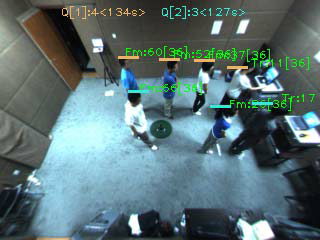
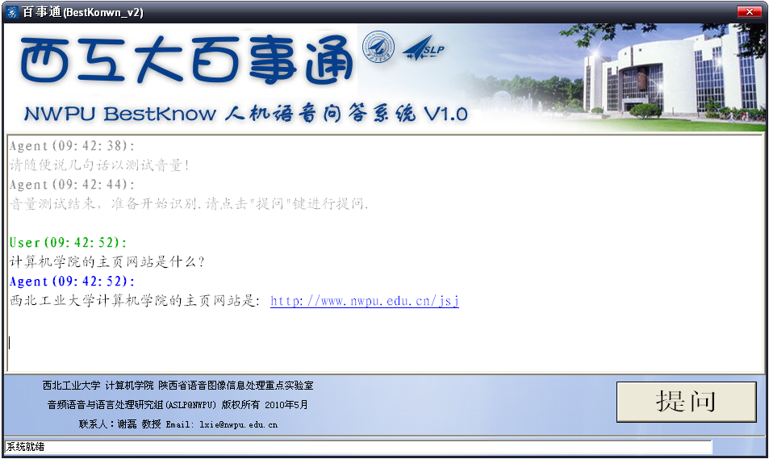
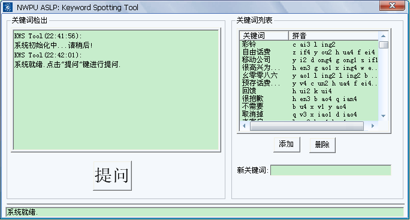



## EDUCATION
* __Sept.2006 – July.2010 (Bachelor)__  
School of Computer Science, 
Northwestern Polytechnical University (NWPU), Xi’an, China.

* __Sept.2010 – present (Pursuing PhD degree)__  
Shaanxi Provincial Key Laboratory of Speech and Image Information Processing (SAIIP) Lab, 
School of Computer Science,
Northwestern Polytechnical University (NWPU), Xi’an, China.

- - -

## RESEARCH EXPERIENCE
<table>
<tr>
	<td width="20%"></td>
	<td>
		<b>Towards a Queue-Aware ATM: Monitoring and Managing Queues in front of ATMs</b> 
		
In order to monitoring queues in front of ATMs, apply stereo camera real-time object tracking approach. With the aid of camera’s real-time tracking, develop a simple application system which can give customer a suggested queue and estimated queuing time.

	</td>
</tr>

<tr>
	<td width="20%"></td>
	<td>
		<b>Keyword Spotting based Real-time Dialog System</b> 
		
Make a question-set limited Dialog System implemented by Keyword Spotting approach with improved Online Garbage Model. My main task is proposing a improved method based on Online Garbage Keyword Spotting Model.

	</td>
</tr>

<tr>
	<td width="20%"></td>
	<td>
		<b>Keyword Spotting Tool</b> 
		
Make a Keyword Spotting Tool which user can dynamically add or remove keywords by hand.

	</td>
</tr>
</table>

- - -

## ACTIVITIES
<table width="100%" border="0">
<tr>
<td><b>Poster Presentation</b></td>
<td>Mar. 26 - 31, 2013</td>
<td>The International Conference on Acoustics, Speech, and Signal Processing (ICASSP '13), Vancouver, Canada.</td>
</tr>

<tr>
<td><b>Academic Visitor</b></td>
<td>Mar., 2012 - Step., 2012</td>
<td>School of Computing Sciences University of East Anglia (UEA), Norwich, U.K.</td>
</tr>

<tr>
<td><b>Conf. Organizing Committee Member</b></td>
<td>Apr., 2011 - Nov., 2011</td>
<td>APSIPA Annual Summit and Conference 2011 (APSIPA ASC 2011), Xi'an, China.</td>
</tr>

<tr>
<td><b>Oral Presentation</b></td>
<td>Nov. 23 - 25, 2010</td>
<td>the International Conference on Audio, Language and Image Processing (ICALIP), Shanghai, China.</td>
</tr>

<tr>
<td><b>Invited Demonstration</b></td>
<td>Oct. 26 - 29, 2010</td>
<td>the 7th International Conference on Ubiquitous Intelligence and Computing (UIC), Xi'an, China.</td>
</tr>

<tr>
<td><b>Intern</b></td>
<td>Jul., 2009</td>
<td>China Pacific Insurance (Group) Co., Ltd. Xi’an Subsidiary, Xi'an, China.</td>
</tr>

<tr>
<td width="200"><b>Intern</b></td>
<td width="150">Jun., 2009</td>
<td>KunShan (Suzhou) Ambow Software Training Base, Suzhou, China.</td>
</tr>
</table>

- - -

