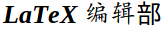



### 网盘

       
<!-- [[百度云网盘]](http://pan.baidu.com/disk/home) 
[[115网盘]](http://115.com/) 
[[360云盘]](http://yunpan.360.cn/) 
[[4Shared]](http://www.4shared.com/) 
[[Box]](https://app.box.com/) -->
- - -
### Bit

   
<!-- [[BYR北邮人]](http://bt.byr.cn/) 
[[蒲公英PT站]](http://pt.stuclub.cn/torrents.php) 
[[KickAss Torrents]](http://kickass.to/) -->
- - -
### 资讯

          
<!-- [[虎嗅]](http://www.huxiu.com/index.php)
[[豆瓣]](http://www.douban.com/)  
[[网易]](http://www.163.com/) 
[[i黑马]](http://www.iheima.com/) 
[[凤凰网]](http://www.ifeng.com/) 
[[南方周末]](http://www.infzm.com/) 
[[外刊IT评论]](http://www.aqee.net/) 
[[163邮箱]](http://mail.163.com/) 
[[Gmail]](https://mail.google.com/mail/ca/u/0/?shva=1#inbox) 
[[Google Calendar]](https://www.google.com/calendar/b/2/render) -->
- - -
### 社交

   
<!-- [[人人网]](http://www.renren.com/) 
[[新浪微博]](http://login.sina.com.cn/member/my.php) 
[[西工大三航四方]](http://bbs.nwpu.edu.cn/portal.php) 
[[GitHub]](https://github.com/zenhacker)  -->

- - -
### 论坛博客类

          
<!-- [[视觉计算研究论坛]](http://www.sigvc.org/bbs/) 
[[PhD Comics]](http://www.phdcomics.com/comics.php) 
[[酷壳]](http://coolshell.cn/) 
[[Ubuntu中文论坛]](http://forum.ubuntu.org.cn/index.php) 
[[OpenCV中文网站]](http://www.opencv.org.cn/) 
[[开源中国]](http://www.oschina.net/) 
[[Coursera]](https://www.coursera.org/) 
[[LaTex编辑部]](http://zzg34b.w3.c361.com/index.htm) 
[[Emacs中文网]](http://emacser.com/)   -->
- - -
### 在线工具

              
<!-- [[Latex Equation Editor]](http://www.numberempire.com/texequationeditor/equationeditor.php) 
[[LaTeX symbol classifier]](http://detexify.kirelabs.org/classify.html) 
[[在线二维码生成器]](http://cli.im/) 
[[Favicon生成器]](http://tools.dynamicdrive.com/favicon/#.UkQ7XIoW20w) 
[[BBC iPlayer Radio]](http://www.bbc.co.uk/radio/#stations) 
[[网上虚拟乐器]](http://www.buttonbass.com/) -->
- - -
### 在线数据库

       
<!--[[ACL Anthology]](http://aclweb.org/anthology//index.html) 
[[中國哲學書電子化計劃]](http://ctext.org/zh) 
[[漢川草廬]](http://www.sidneyluo.net/index.html) 
[[皮皮书屋]](http://www.ppurl.com/) -->
- - -
### Coding

  
<!-- [[TopCoder]](http://www.topcoder.com/) 
[[PKU Online Judge]](http://poj.org/)  -->
- - -

