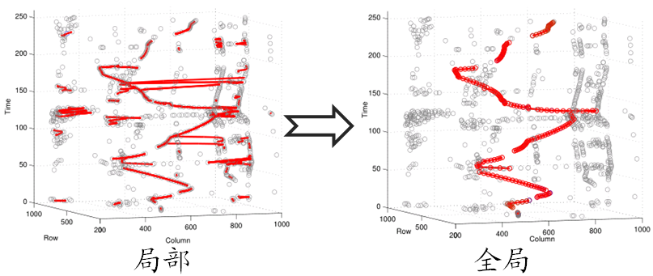
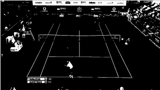
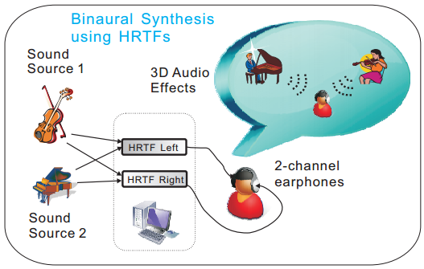



<table width="100%" border="0">
<tr><td width="20%"><b>2013</b></td></tr>
<tr>
<td></td>
<td><a href="#">A Two Layered Data Association Approach For Tennis Ball Tracking</a>
 <i>Xiangzeng Zhou, Qiang Huang, Lei Xie, and Stephen J. Cox</i>
 The 38th International Conference on Acoustics, Speech, and Signal Processing (ICASSP '13), May 26-31, 2013, Vancouver, Canada
 [<a href="#">bibtex</a>]</td>
</tr>
</table>

- - -
<table width="100%" border="0">
<tr><td width="20%"><b>2012</b></td></tr>
<tr>
<td></td>
<td><a href="publication/Huang-2012-6411936.pdf">Detection of ball hits in a tennis game using audio and visual information</a>
 <i>Qiang Huang, Stephen Cox, Xiangzeng Zhou, and Lei Xie</i>
 The Asia-Pacific Signal and Information Processing Association (APSIPA '12), 2012, Xi'an, China.
 [<a href="publication/Huang-2012-6411936.bib">bibtex</a>]</td>
</tr>
</table>

- - -
<table width="100%" border="0">
<tr><td width="20%"><b>2011</b></td></tr>
<tr>
<td></td>
<td><a href="#">基于多置信特征融合语音识别拒识算法的设计与实现</a>
 <i>牛建伟, 谢磊, 路晓明, 周祥增, 张艳宁</i>
 第十一届全国人机语音通讯学术会议, 2011, 西安, 中国.
 [<a href="#">bibtex</a>]</td>
</tr>
<tr>
<td></td>
<td><a href="#">Real-time speech-driven virtual avatar</a>
 <i>Bingfeng Li, Xiangzeng Zhou</i>
 The 11st National Conference on Man-Machine Speech Communication (NCMMSC '11), 2011. Xi’an China.
 [<a href="#">bibtex</a>]</td>
</tr>
</table>

- - -
<table width="100%" border="0">
<tr><td width="20%"><b>2010</b></td></tr>
<tr>
<td></td>
<td><a href="publication/Xie-2010-5667124.pdf">Speech and Auditory Interfaces for Ubiquitous, Immersive and Personalized Applications</a>
 <i>Lei Xie,Wenhuai Zhao, Xiangzeng Zhou, Xiaohai Tian, Bingfeng Li, Naicai Sun, Yali Zhao, Yanning Zhang</i>
 Ubiquitous Intelligence Computing and 7th International Conference on Autonomic Trusted Computing (UIC/ATC), October 26-29, 2010, China.
 [<a href="publication/Xie-2010-5667124.bib">bibtex</a>]</td>
</tr>
</table>
- - -
